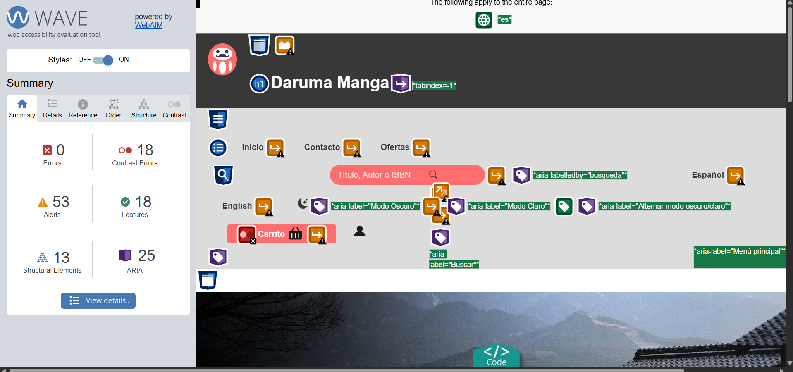

# Daruma Manga Web

**Daruma Manga** es una página web diseñada como proyecto para el módulo de **Diseño de Interfaces Web** (DIW).

## Descripción

Este sitio web simula una librería online especializada en manga y cultura japonesa. Cuenta con varias secciones como:

- Página principal con hero y banner diseñado con Google Web Designer
- Ficha de libro con acordeón usando Bootstrap
- Página de contacto con mapa interactivo y video incrustado
- Página de búsqueda de libros y ofertas con carrusel de imágenes
- Página del carrito de la compra que hace uso del LocalStorage
  
Las páginas cuentan con animaciones, modo oscuro/claro e interacciones accesibles (atajos de teclado, navegación por tabulador, etc.).

La web ha sido diseñada con HTML, CSS y JavaScript, aplicando buenas prácticas de accesibilidad y diseño adaptable (*responsive design*).

## Autora

Este proyecto ha sido desarrollado por:

**Silvia César Garrido**  
Curso 2024/2025  
IES Al-Ándalus de Almería, España

## Vista previa

Puedes ver la web publicada en GitHub Pages aquí:  
[https://sicega.github.io/Daruma-Manga-Web](https://sicega.github.io/Daruma-Manga-Web)

## Video demostración de su funcionamiento

[Ver video de Youtube](https://youtu.be/SJVQD2G8JO0)

## Muestra de su nivel de accesibilidad

